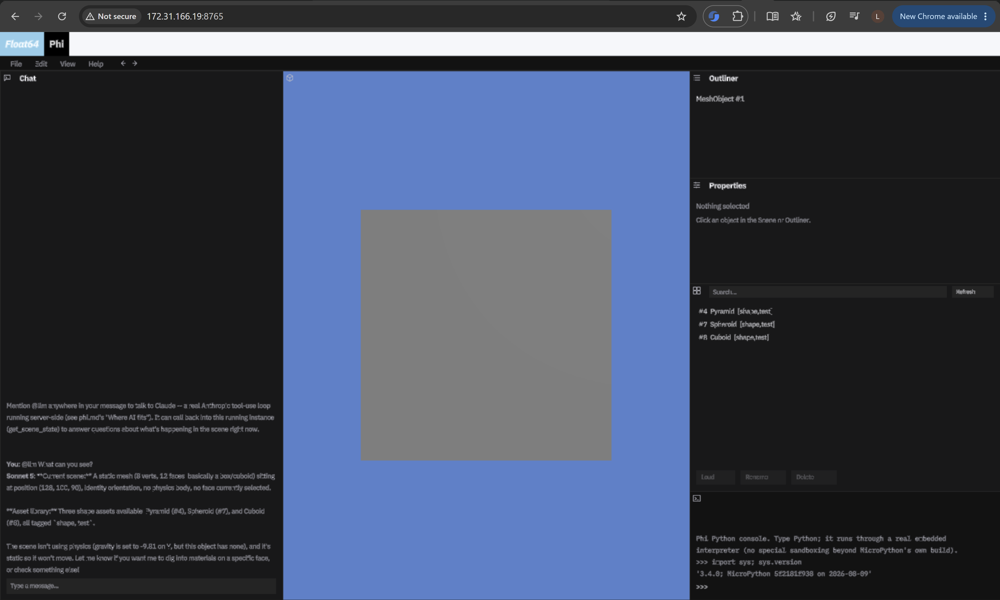

# Phi

**A browser-native and desktop game engine with a Blender-style editor, real Python scripting, and Claude built in as a first-class editor participant.**



Phi ships as a single opaque `engine.wasm` (or a native executable on
Linux/Windows/macOS) that *is* the mesh editor, the animation editor, and the
node-graph system all at once. There's no separate authoring tool and no
separate runtime: the same binary edits a scene live and plays it. All game
logic, NPC behaviour, and tool UI (`@phi.panel`) are written in Python — the
same Python everywhere, running on a real embedded MicroPython interpreter,
not a scripting sandbox bolted on after the fact.

A standalone-game path ships alongside the editor: `phi.h` aggregates the 
engine's actual internals — geometry operations, Bullet physics, 
animation/armature playback, node graphs, render-pass
hooks, gamepad input — into one public C header, so a `game/src/main.c`
written against it today compiles and links, no stubs. The same
ground is covered from Python: `phi.*` is a real, fairly rich API (mesh
editing, physics, animation playback, node graphs, per-face materials).
Custom shaders are possible now too, if low-level — `render_hooks.h` lets C
code register a callback at one of four pipeline insertion points and
write raw GL/GLSL against the live `GBuffer*`, with no asset-pipeline
convenience yet. Gamepad input, including Steam Deck, runs on a
vendored SDL2 `GameController` subsystem (`SDL_GameControllerDB`'s 
mapping database) — Steam Deck runs a standard Linux desktop under the hood,
so the same native build covers it. And a game built this way ships
chromeless: `player_main.c` is an independent driver with no editor UI, no
Asset Browser, no live server connection, just `./game/` loaded into a real
per-frame gameplay loop.

```
Language:    C (Emscripten -> WASM, or native via glext.h — no SDL/GLFW)
Rendering:   WebGL 2 (GLES3) in-browser, OpenGL 3.3 core natively,
             deferred (G-buffer) pipeline with TAA
Scripting:   MicroPython, embedded directly into engine.wasm
Physics:     Bullet, compiled straight into the same binary
Networking:  WebSockets (RFC 6455 — hand-rolled client + server)
Server:      Pure Python stdlib — no third-party dependencies
Mesh format: glTF 2.0 (.glb/.gltf) — no bespoke format, ever
```

## What makes this different

- **Blender DNA/RNA-style UI, not Dear ImGui.** A real recursive area-split
  panel system (drag-to-resize, split, join) written in C, with panels
  authorable from Python via `@phi.panel` — the same pattern Blender itself
  uses, not a re-skin of an immediate-mode debug UI.
- **Claude runs inside the editor**, not beside it as a chat-window bolt-on.
  The Chat panel talks to a real Anthropic tool-use loop running
  server-side — mention `@llm` and it can introspect the live running scene
  (`get_scene_state`) and your asset library (`get_asset_list`) to answer
  real questions about what you're building. The API key never ships to a
  client; it lives on the authoring server only.
- **One mesh representation, one file format.** The editor holds a real
  half-edge structure for live topology edits (extrude, inset, loop cut);
  glTF is the load/save interchange format, not a lossy round-trip through
  something else.
- **Client-authored, server-persisted.** Every edit — a vertex drag, a
  Python panel's button click, an AI-proposed change — applies locally
  first and is reconciled by an authoritative server, the same pattern
  proven out in this codebase's own predecessor project (`qek`, a
  multiplayer octree-editor arena shooter).

## Status

Phase 0 (deferred renderer, G-buffer, TAA) and Phase 1 (mesh editor: picking,
gizmos, extrude/inset/loop-cut, PBR materials per face, Voronoi
pre-fracture, the full Native UI System, DNA/RNA property system, a real
Python console, the Asset Browser, and the Chat panel described above) are
built and verified. Phase 2 (Bullet physics — vendored, wrapped in a hand
-written C API since Bullet has no official one, wired into both the editor
and its Python API) is also landed. Phase 9 (standalone-game shipping — the
editor/player split, `./game/` loading, the `phi.h` C API, node graphs,
render-pass hooks, and vendored-SDL2 gamepad/Steam Deck support) is landed
and build-verified too; the Asset Browser's "mark this asset for `./game/`"
UI is the one piece of it still outstanding. See [`phi.md`](phi.md) for the complete
phase-by-phase engineering brief, including exactly what's verified vs.
still a known gap at any given point.

## Quick start

### Build

```bash
make native     # native editor binary -> build/phi_native  (fastest edit loop)
make wasm       # browser editor build -> www/game.js + www/game.wasm
                 # (needs Emscripten: source /path/to/emsdk/emsdk_env.sh first)
make win32       # cross-compiled Windows editor binary -> build/phi_win32.exe
make player      # standalone chromeless game binary -> build/phi_player
                 # (native only; boots ./game/main.py or ./game/src/main.c)
```

### Run

```bash
cd server && python3 server.py
```

Then open `http://localhost:8765` for the browser build, or run
`build/phi_native` directly for the native one. Both talk to the same
server over the same WebSocket protocol.

### Talk to Claude in the editor

Set `ANTHROPIC_API_KEY` in the server's own environment before launching
`server.py` — never in a client, never committed. Then open the Chat panel
and mention `@llm` anywhere in your message.

## Layout

```
client/     Engine + editor, plain C (compiles unchanged with gcc or emcc)
  editor_main.c       editor entry point / frame loop (full panel UI)
  player_main.c       standalone-game entry point — no editor chrome, see phi.md's Phase 9
  phi.h               public C API for game/src/*.c (geometry, physics, animation, node graphs, render hooks, gamepad)
  ui.c, area_tree.c   Native UI System — panel layout, DNA/RNA-style widgets
  meshobject.c, halfedge.c, halfedge_gltf.c   editable mesh representation
  mesh_edit.c, fracture.c, gizmo.c            editing operations
  mp_port.c           MicroPython embedding + the phi.* Python API surface
  phi_physics.cpp     hand-written C wrapper over vendored Bullet
  render_hooks.c      C-level render-pass insertion points for custom shaders
  chat.c, console.c, asset_browser.c, net.c   editor panels + wire protocol
  vendor/             Bullet, MicroPython, cgltf, nanosvg, stb, SDL2 (gamepad only) — all vendored

server/     Pure-Python stdlib HTTP + WebSocket server, asset DB, and the
            Anthropic tool-use loop the Chat panel talks to

www/        Browser shell (index.html + the emcc-generated game.js/game.wasm)
assets/     glTF test assets + the uploaded asset library
```

## Full engineering brief

[`phi.md`](phi.md) is the living design document and status log for this
project — architecture decisions, the full 8-phase roadmap, and a dated,
honest account of what's actually been built and verified vs. still
outstanding at every stage. Start there for anything beyond a quick look.

---

Float64 LLC
