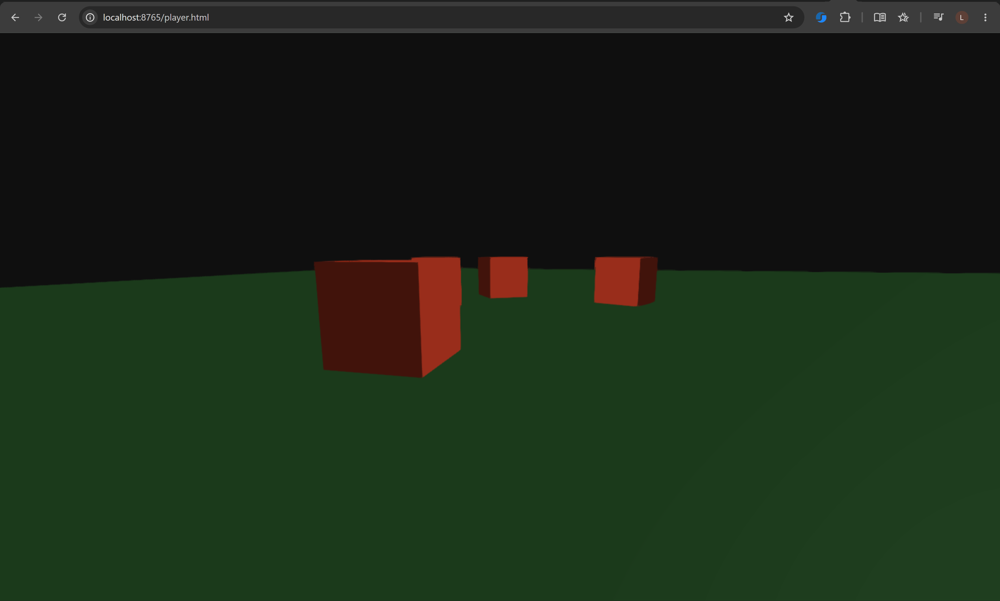
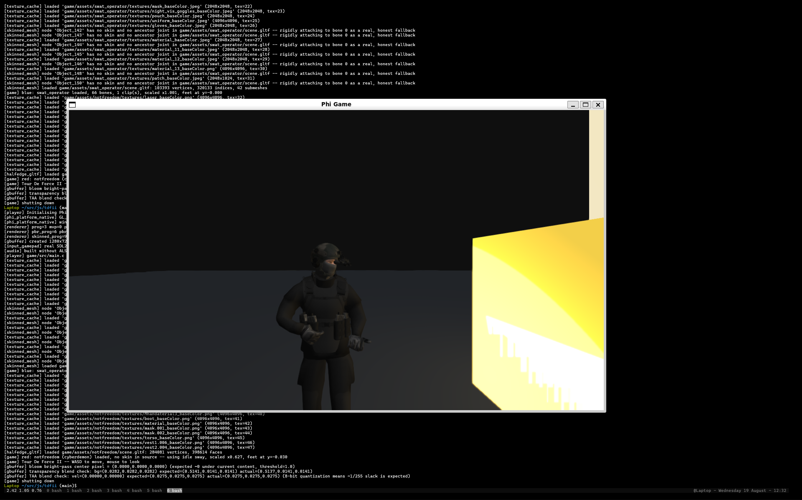

# Phi

**A browser-native and desktop game engine with a Blender-style editor, Python scripting, and Claude built in as a first-class editor participant.**





Phi ships as a single opaque `engine.wasm` (or a native executable on
Linux/Windows/macOS) that is the mesh editor, the animation editor, and the
node-graph system at once. There's no separate authoring tool and no
separate runtime: the same binary edits a scene live and plays it. Game
logic, NPC behaviour, and tool UI (`@phi.panel`) are written in Python,
running on an embedded MicroPython interpreter — the same language and the
same API surface in the editor and in a shipped game.

A standalone-game path ships alongside the editor. `phi.h` aggregates the
engine's internals — geometry operations, Bullet physics, animation/armature
playback, node graphs, render-pass hooks, gamepad input, keyboard/mouse
input, camera control, and audio — into one public C header, so
`game/src/main.c` compiles and links against it directly. The same ground is
covered from Python: `phi.*` exposes mesh editing, whole-object transforms,
object-id-keyed physics, animation playback, node graphs, per-face
materials, keyboard/mouse/gamepad input, and sound playback, all addressed
by object id rather than through the editor's own selection state. Custom
shaders are supported at a low level — `render_hooks.h` lets C code register
a callback at one of four pipeline insertion points and write GL/GLSL
against the live `GBuffer*`. Gamepad input, including Steam Deck, runs on a
vendored SDL2 `GameController` subsystem (`SDL_GameControllerDB`'s mapping
database); Steam Deck runs a standard Linux desktop under the hood, so the
native build covers it without extra work. Audio is a hand-written WAV
decoder and mixer, with ALSA on native Linux (detected at build time, with a
no-op fallback otherwise) and the Web Audio API in the browser, including
positional 3D sound. A shipped game runs chromeless: `player_main.c` is an
independent driver with no editor UI, no Asset Browser, and no live server
connection, loading `./game/` into a per-frame gameplay loop with its own
camera, input, physics, and audio.

`game/src/main.c` is a playable first-person-shooter example built entirely
in C — WASD movement, mouse look under OS/browser pointer capture, and
physics-driven targets — with no MicroPython in the hot path. `make
player_wasm` builds the same game for the browser, for evaluation without a
native toolchain; it isn't part of the standalone-shipping path itself,
which stays native-only.

```
Language:    C (Emscripten -> WASM, or native via glext.h — no SDL/GLFW)
Rendering:   WebGL 2 (GLES3) in-browser, OpenGL 3.3 core natively,
             deferred (G-buffer) pipeline with TAA
Scripting:   MicroPython, embedded directly into engine.wasm
Physics:     Bullet, compiled straight into the same binary
Networking:  WebSockets (RFC 6455 — hand-rolled client + server)
Server:      Pure Python stdlib — no third-party dependencies
Mesh format: glTF 2.0 (.glb/.gltf) — no bespoke format
```

## What makes this different

- **Blender DNA/RNA-style UI, not Dear ImGui.** A recursive area-split panel
  system (drag-to-resize, split, join) written in C, with panels authorable
  from Python via `@phi.panel` — the same architecture Blender uses, not an
  immediate-mode debug UI dressed up.
- **Claude runs inside the editor**, not beside it as a chat-window bolt-on.
  The Chat panel talks to an Anthropic tool-use loop running server-side —
  mention `@llm` and it can introspect the live scene (`get_scene_state`)
  and the asset library (`get_asset_list`) to answer questions about what
  you're building. The API key stays on the authoring server; it never
  ships to a client.
- **One mesh representation, one file format.** The editor holds a
  half-edge structure for live topology edits (extrude, inset, loop cut);
  glTF is the load/save interchange format, not an intermediate that loses
  information on round-trip.
- **Client-authored, server-persisted.** Every edit — a vertex drag, a
  Python panel's button click, an AI-proposed change — applies locally
  first and is reconciled by an authoritative server, the same pattern this
  codebase's predecessor project (`qek`, a multiplayer octree-editor arena
  shooter) established.
- **Real CPU-load capping, on all three platforms.** The engine measures
  its own per-frame work and keeps CPU busy time at or below 70% (native:
  a real sleep between frames; wasm: throttling the browser's own callback
  cadence, since a browser tab's main thread can't be blocked outright) —
  one shared implementation reused by the editor and the standalone player
  alike, not three platform-specific ones. Idea credited to Ty Clifford
  <ty@tyclifford.com>.

## Status

Phase 0 (deferred renderer, G-buffer, TAA), Phase 1 (mesh editor: picking,
gizmos, extrude/inset/loop-cut, PBR materials per face, Voronoi
pre-fracture, the Native UI System, DNA/RNA property system, a Python
console, the Asset Browser, and the Chat panel described above), and Phase 2
(Bullet physics, wrapped in a hand-written C API since Bullet ships no
official one, wired into both the editor and its Python API) are complete.
Phase 9 (standalone-game shipping — the editor/player split, `./game/`
loading, the `phi.h` C API, node graphs, render-pass hooks, vendored-SDL2
gamepad/Steam Deck support, camera control, whole-object transforms,
keyboard/mouse input, and object-id-keyed physics) and Phase 10 (audio — WAV
decode/mixing, native ALSA, wasm Web Audio, a win32 stub, and Python
bindings) are also complete, demonstrated end to end by OS/browser pointer
capture (`input_capture_mouse`) and the first-person-shooter example
(`game/src/main.c`, `make player` / `make player_wasm`). Outstanding: the
Asset Browser's "mark this asset for `./game/`" UI, and win32 support for
both the player target and native audio — none built or verified in this
project's history yet. See [`phi.md`](phi.md) for the full phase-by-phase
brief, including what's verified versus outstanding at any given point.

## Quick start

### Build

```bash
make native     # native editor binary -> build/phi_native  (fastest edit loop)
make wasm       # browser editor build -> www/game.js + www/game.wasm
                 # (needs Emscripten: source /path/to/emsdk/emsdk_env.sh first)
make win32       # cross-compiled Windows editor binary -> build/phi_win32.exe
make player      # standalone chromeless game binary -> build/phi_player
                 # (native only; boots ./game/main.py or ./game/src/main.c)
make player_wasm # same game, browser build -> www/player.js + www/player.wasm
                 # (for evaluation without a native toolchain — see Status;
                 #  the standalone-shipping path itself stays native-only)
```

An example ships in `./game/`: a first-person shooter (`game/src/main.c`)
with physics targets and OS/browser mouse capture. Build and run with
`make player && ./build/phi_player`, or `make player_wasm` and open
`player.html` (see Run, below). Click the canvas to lock the mouse, WASD to
move, click to shoot, Escape to release.

### Run

```bash
cd server && python3 server.py
```

Open `http://localhost:8765` for the browser editor, or
`http://localhost:8765/player.html` for the browser player build (`make
player_wasm`), or run `build/phi_native` / `build/phi_player` directly for
the native builds. `server.py` serves all of it; the player build makes no
live server connection at runtime, so this is only serving static files for
that path.

### Talk to Claude in the editor

Set `ANTHROPIC_API_KEY` in the server's own environment before launching
`server.py` — never in a client, never committed. Then open the Chat panel
and mention `@llm` anywhere in your message.

## Layout

```
client/     Engine + editor, plain C (compiles unchanged with gcc or emcc)
  editor_main.c       editor entry point / frame loop (full panel UI)
  player_main.c       standalone-game entry point — no editor chrome, see phi.md's Phase 9
  phi.h               public C API for game/src/*.c (geometry, physics, animation, node graphs, render hooks, gamepad)
  ui.c, area_tree.c   Native UI System — panel layout, DNA/RNA-style widgets
  meshobject.c, halfedge.c, halfedge_gltf.c   editable mesh representation
  mesh_edit.c, fracture.c, gizmo.c            editing operations
  mp_port.c           MicroPython embedding + the phi.* Python API surface
  phi_physics.cpp     hand-written C wrapper over vendored Bullet
  render_hooks.c      C-level render-pass insertion points for custom shaders
  phi_audio.h, audio_wav.c, audio_native.c, audio_wasm.c   WAV decode/mixer + ALSA/Web Audio backends
  chat.c, console.c, asset_browser.c, net.c   editor panels + wire protocol
  vendor/             Bullet, MicroPython, cgltf, nanosvg, stb, SDL2 (gamepad only) — all vendored

server/     Pure-Python stdlib HTTP + WebSocket server, asset DB, and the
            Anthropic tool-use loop the Chat panel talks to

www/        Browser shells: index.html (editor) + player.html (player),
            each loading its own emcc-generated .js/.wasm
assets/     glTF test assets + the uploaded asset library

game/       Example game — what `make player` / `make player_wasm` boot
  src/main.c   the FPS example (game_init/game_tick/game_shutdown, no MicroPython)
  main.py      an equivalent Python-driven example (mutually exclusive with
               src/main.c at build time — see phi.md's Phase 9 "./game/
               directory" section)
```

## Full engineering brief

[`phi.md`](phi.md) is the living design document and status log for this
project — architecture decisions, the full 10-phase roadmap, and a dated
account of what's built and verified versus outstanding at every stage.
Start there for anything beyond a quick look.

---

Float64
